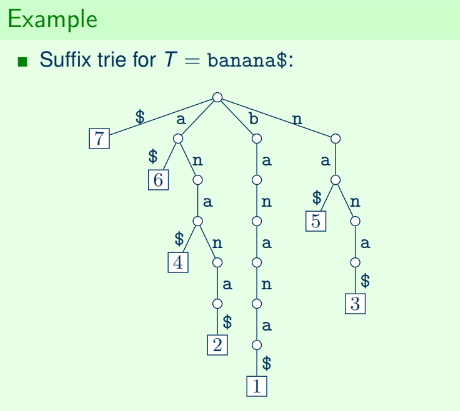
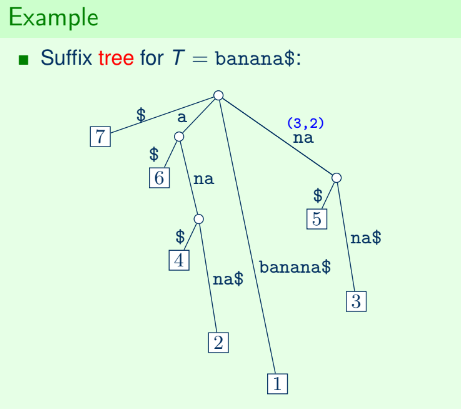
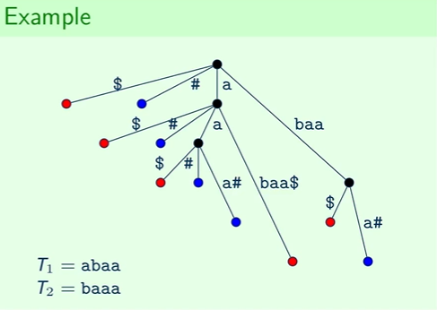

## Lecture 3: Suffix Tree

### Suffix Trie
- Worst case size is $\Theta(n^2)$.
    - Example: $T = a^{n/2} b^{n/2}$
- For any pattern $P$, checking if $P$ is a prefix of some suffix of $T$ can be done in $\mathcal{O}(m)$ time.
- Checking if $P$ occurs in $T$ can be done in $\mathcal{O}(m)$ time.

### Suffix Tree
- Compact suffix trie of $T$.
- Number of nodes: $\mathcal{O}(n)$
- Each edge label can be encoded in $\mathcal{O}(1)$ space as a pair $(i, l)$, a substring of $T$ starting at index $i$ with length $l$.
- Total space: $\mathcal{O}(n)$
- Can be computed in $\mathcal{O}(n)$ time.

### Suffix Tree Algorithms
- $Occ(T, P) \neq 0$
    - Traverse tree while following edges that match the pattern.
    - time: $\mathcal{O}(m)$
- Enumerate all $i \in Occ(T, P)$
    - Traverse tree the same way as above, except all located leaf nodes are printed.
    - time: $\mathcal{O}(m + occ)$
- $|Occ(T, P)|$
    - Precompute number of leaf nodes below each internal node.
        - Recursive tree traversal, the number of leaves within child subtrees are added together.
        - Can be done in linear time.
    - Traverse tree the same way as above, then print leaf node count.
    - time: $\mathcal{O}(m)$
- $\min Occ(T,P)$
    - For each internal node, precompute the leaf node with the lowest index that can be reached.
        - Recursive tree traversal, the minimum of the child subtrees is stored.
    - Traverse tree the same way as above, then print stored index.
    - time: $\mathcal{O}(m)$

### Longest Common Substring
- Find longest string $S$ that is a substring of both strings $T_1$ and $T_2$.
    - Append `$` at the end of $T_1$.
    - Append `#` at the end of $T_2$.
    - Construct compact trie (generalized suffix tree) for $S$ containing substrings of both $T_1$ and $T_2$.
    - Mark a node `red` if its subtree contains a leaf node at the end of a `$` label.
    - Mark a node `blue` if its subtree contains a leaf node at the end of a `#` label.
    - Return deepest node that is marked both `red` and `blue`.
- Size of $S$: $\mathcal{O}(n_1 + n_2)$
- Construction: $\mathcal{O}(n_1 + n_2)$ time

