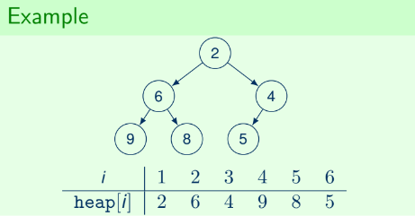

## Lecture 5: Sorting

### Merge Sort
- $\mathcal{O}(n \log n)$ time
- $\mathcal{O}(n)$ extra space
```py
# recursive main function

def mergesort(int[] a):
    if len(a) == 1:
        return a

    array1 = a[0 ... n/2]       # first half of input array
    array2 = a[n/2+1 ... n]     # second half of input array

    array1 = mergesort(array1)  # arrays get continuously
    array2 = mergesort(array2)  # split in half

    return merge(array1, array2)


# helper function

def merge(int[] a, int[] b):
    c = []

    while len(a) > 0 and len(b) > 0:
        '''push smallest between a[0] and b[0] to c'''
        '''remove element from corresponding array'''

    # at this point either a or b is empty
    '''push remaining elements from non-empty array to c'''

    return c
```

### Priority Queue (PQ)
- A data structure $Q$ that maintains a set of numbers $A$ and supports the following operations:
    - $Min(Q)$: return the minimum value in $A$
    - $Insert(Q, x)$: add $x$ to set $A$
    - $ExtractMin(Q)$: remove and return the minimum value in $A$

### Heap Sort
- A binary tree where:
    - all levels but the last are fully complete.
    - last level is filled from left to right.
    - root of every subtree stores the smallest element within the subtree.
- For each node `v` stored in $heap[i]$:
    - `parent(v)` = $heap[i/2]$
    - `leftchild(v)` = $heap[2i]$
    - `rightchild(v)` = $heap[2i+1]$
- Time = $\mathcal{O}(n \log n)$



```py
# arrays are 1-indexed

def Min():
    return heap[1]

def Insert(x):
    heap[++size] = x            # push to heap
    HeapUp(size)

def ExtractMin():
    ret = heap[1]
    heap[1] = heap[size--]      # get last element in heap, pop
    HeapDown(1)


def HeapUp(i):
    while i > 1 and heap[i/2] > heap[i]:
        swap(heap[i/2, heap[i]])
        i = i/2

def HeapDown(i):
    min = i
    while true:
        '''if 2i <= size and heap[2i] < heap[min]''':
            min = 2*i
        '''if 2i+1 <= size and heap[2i+1] < heap[min]''':
            min = 2*i + 1
        if min != i:
            swap(heap[i], heap[min])    # switch with one child
            i = min
        else:
            break


```
- $min = \mathcal{O}(1)$
- $Insert = \mathcal{O}(\log n)$
- $ExtractMin = \mathcal{O}(\log n)$

### Quicksort
- A pivot is chosen.
    - All elements left of the pivot must be less than the pivot.
    - All elements right of the pivot must be greater than the pivot.
- Worst case $\mathcal{O}(n^2)$ time
- Average $\mathcal{O}(n \log n)$ time
```py
# main function call

Quicksort(A, 0, len(A) - 1)


def Quicksort(int[] A, int low, int high):
    if low < high:
        pivot = Partition(A, low, high)
        Quicksort(A, low, pivot - 1)        # elements < pivot
        Quicksort(A, pivot + 1, high)       # elements > pivot


def Partition(int[] A, int low, int high):
    pivotIndex = random(low, high)          # inclusive random
    swap(A[pivotIndex], A[high])
    pivot = A[high]

    left = low
    right = high - 1                        # -1 because high is pivot
    while left <= right:
        # locate leftmost value greater than pivot
        if A[left] <= pivot:
            left += 1
        # locate rightmost value less than pivot
        elif A[right] >= pivot:
            right -= 1
        # both bounds located
        else:
            swap(A[left], A[right])
            left += 1
            right -= 1

    swap(A[left], A[high])                  # move pivot in between
    return left
```