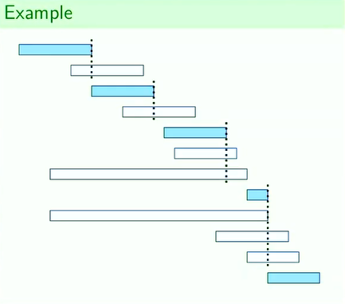

## Scheduling

### Scheduling
- Given $n$ activities, there is an array $S$ with the start times of each activity and array $F$ with the finish times.
- Activities are sorted by earliest finish time.
- Activities $i$ and $j$ are compatible if $[S[i]...F[i])$ and $[S[j]...F[j])$ do not overlap.
- Calculate the size of the largest set of compatible activities.

```py
# S, F: array of length n
def OptScheduling(S, F):
    ans = 0
    last = 0
    for i in range(1, n):
        if S[i] >= F[last]:
            ans += 1
            last = i

    return ans
```
- Greedy algorithm
- $\mathcal{O}(n)$ time complexity
    - Uses the fact that there exists an optimal solution that contains the earliest finishing activity ($S[0]$, $F[0]$).

