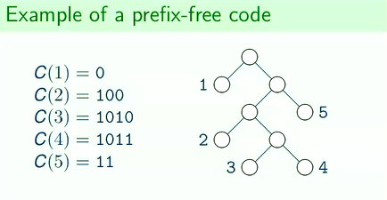

## Huffman Coding

### Huffman Coding
- Greedy algorithm
- **Input**
    - alphabet of $n$ characters
    - array $F$ of frequencies of each character (also length $n$)
- There is a function $C$ that takes any character from the array and assigns a _bitstring_ to it.
    - $C$ is called a _code_.
    - $C$ is _prefix-free_ if for every two characters `a` and `b` such that $a \neq b$, $C(a)$ is not a prefix of $C(b)$.
    
        - `0` = left
        - `1` = right
- A _message_ is formed by concatenating $C[i]$ by $F[i]$ amount of times for each $i$.
    - Does not contain separators between bitstrings, but can be figured out if the code is prefix-free or suffix-free.
- **Output**:
    - A prefix-free code $C$ with the smallest message length.

### Huffman Coding Algorithm
- Keep merging least frequent symbols
```
ex. given a list of frequencies:
F[1] = 40
F[2] = 10
F[3] = 10
F[4] = 10
F[5] = 30

Step 1:
F[1] = 40
F[2] = 10
F[6] = 20       6 is formed by 3 and 4
F[5] = 30

Step 2:
F[1] = 40
F[7] = 30       7 is formed by 2 and 6
F[5] = 30

Step 3:
F[1] = 40
F[8] = 60       8 is formed by 7 and 5

Step 4:
F[9] = 100      9 is formed by 1 and 8


Total nodes:

i       |   1   2   3   4   5   6   7   8   9
-----------------------------------------------
F[i]    |   40  10  10  10  30  20  30  60  100


Construct binary tree from F[i]
```


```
Result:
C(1) = 0
C(2) = 100
C(3) = 1010
C(4) = 1011
C(5) = 11
```
- $\mathcal{O}(n \log n)$ time to build Huffman Tree