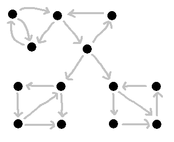
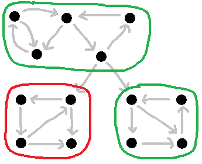
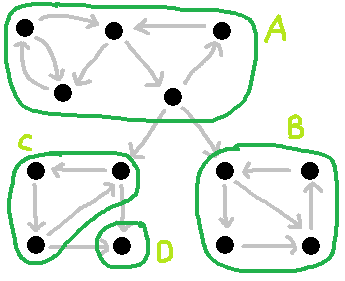
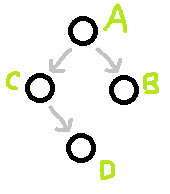

## DFS

### Depth First Search
- Follow one path to the end before backtracking to visit the remaining nodes.
- $\mathcal{O}(|V| + |E|)$ runtime

```js
// calculates distance from start node

let color = [n]         // color of node
let prev = [n]          // previous node from i to start
let d = [n]             // distance from start node to i
let f = [n]             // finishing time for node i 

let time = undefined

function DFS(G, s):

    for(let i = 0; i < n; i++):
        color[i] = WHITE        // WHITE = not visited
        prev[i] = null

    time = 1

    for(let i = 0; i < n; i++):
        if color[i] == WHITE :
            DFSVisit(G, i)


function DFSVisit(G, u):
    d[u] = time++
    color[u] = GRAY             // GRAY = visited, not finished processing

    for v in Adj(u):
        if color[v] == WHITE :
            prev[v] = u
            DFSVisit(G, v)

    color[u] = BLACK            // BLACK = visited and fully processed
    f[u] = time++
```

### Directed Acyclic Graph
- A directed graph without cycles.

### Topological Sort
- **Input**: A directed acyclic graph $G = (V, E)$
- **Output**: A node sequence such that if $(u, v) \in E$, then $u$ occurs before $v$ in the sequence


- Lemma
    - For every edge $(u, v) \in E$ in a DAG, it holds that $f[u] > f[v]$
- Solution
    - Start with an empty list $L$.
    - Run DFS to compute $f[u]$ for every node $u \in V$.
    - Each time $f[u]$ is computed, push $u$ at the front of $L$.
    - return $L$

### Strongly Connected Components
- A strongly connected component of $G$ is the largest set of nodes $C \subseteq V$ such that for every $u, v \in C$, $u$ and $v$ are reachable from each other.
    - For a set of nodes, if you can cycle through every node and return back where you started, it is a strongly connected component.
- **Input**: Directed graph $G$, cycles allowed
- **Output**: The set of nodes $V$ split into strongly connected components.




- The red circle is not a strongly connected component, because the bottom right vertex cannot visit any other vertices.



- If you convert each strongly connected component into a node, the resulting graph should contain no cycles.
    - 
    - A cycle present would mean that the components were not maximal.

Solution
- $G^T$ = transpose of $G$, every edge $E$ is reversed ($E^T$)
1. Call $DFS(G)$ to compute $f[u]$ for all vertices.
2. Compute $G^T$.
3. Call $DFS(G)$ but visit vertices in decreasing order of $f[u]$.
3. Output vertices of each $DFS(G)$ call as a separate strongly connected component
- $\mathcal{O}(|V|+|E|)$ time